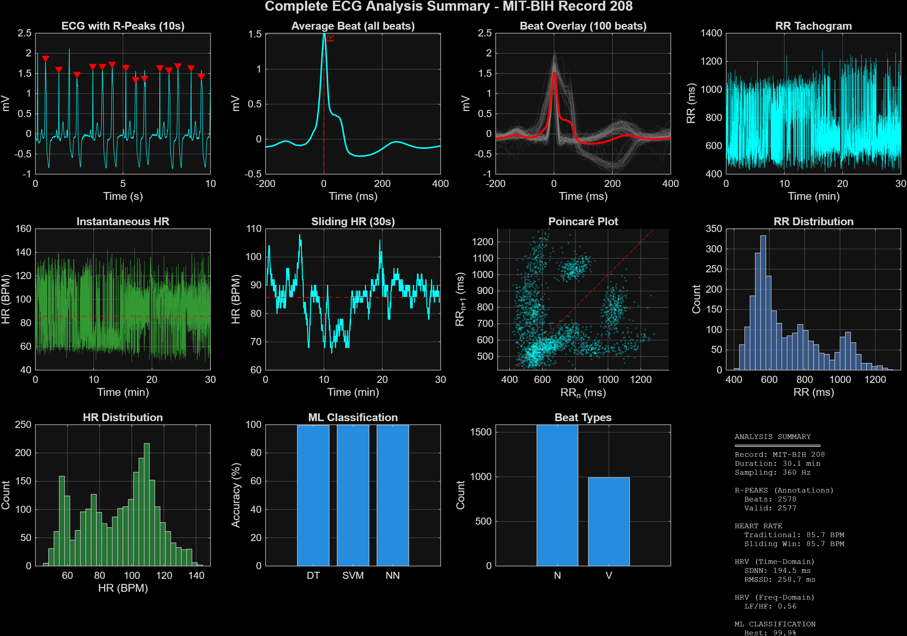
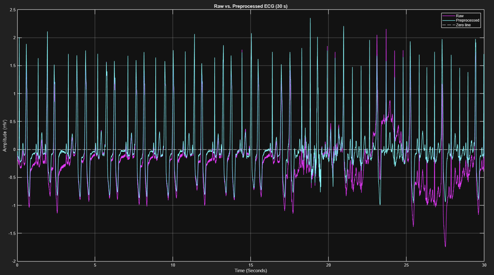
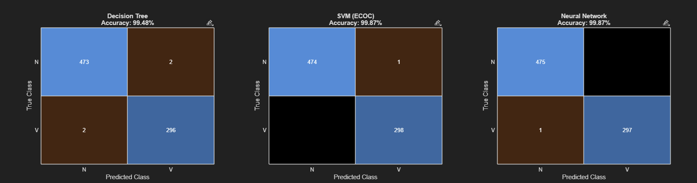

# ECG Signal Analysis and Beat Classification (MIT-BIH Record 208)

An end-to-end MATLAB pipeline for a single long-term ECG recording: signal
preprocessing, beat segmentation, heart rate and heart rate variability (HRV)
analysis, supervised beat classification and unsupervised beat clustering.

Developed individually as my contribution to a group project in Medical Signals
Analysis, MSc Medical Engineering & Analytics, Carinthia University of Applied
Sciences (2026).

---

## Overview

The script `ecg_analysis_record208.m` runs in seven parts:

1. **Preprocessing.** Frequency analysis of the raw signal (FFT), a 4th-order
   Butterworth high-pass filter at 0.5 Hz to remove baseline wander, and a 60 Hz
   IIR notch filter for powerline interference, all applied with zero-phase
   filtering (`filtfilt`)
2. **R-peak detection.** R-peak locations and beat labels are taken from the
   expert annotations supplied with the database
3. **Beat segmentation.** Each beat is extracted as a fixed window around its
   R-peak, and a template built from normal beats is used to compare beat
   morphology across beat types
4. **Heart rate analysis.** RR intervals with outlier removal, overall heart
   rate and heart rate over sliding time windows
5. **HRV metrics.** Time domain (SDNN, RMSSD, pNN50) and frequency domain (LF and
   HF power from a Welch power spectral density of the interpolated RR series)
6. **Supervised beat classification.** Beat types with at least 10 examples are
   classified from the beat waveforms using a decision tree, a multi-class SVM
   and a shallow neural network (70/30 stratified hold-out split). The decision
   tree is analysed further with feature importance, learning curves, depth
   tuning, pruning and a PCA decision-boundary plot
7. **Unsupervised beat clustering.** PCA on the standardised beat waveforms,
   k-means with the number of clusters chosen from the data, and hierarchical
   clustering (Ward linkage), compared against the expert labels

The script ends with a summary of all results.

## Results

*Overview of the full analysis of MIT-BIH record 208: R-peak detection, beat
morphology, heart rate, RR interval and Poincaré analysis, and beat classification.*

Record 208 (MLII lead, 360 Hz, 30.1 minutes) contains 2,578 annotated beats,
2,577 of which were segmented using a window of −200 to +400 ms around each
R-peak. The record is dominated by normal beats (N) and premature ventricular
contractions (V), the two classes with enough examples for classification.

**Heart rate.** Mean heart rate was 85.7 BPM (instantaneous range 46.9–144.0
BPM; 30-second sliding windows 66.0–108.0 BPM).

**Beat classification** (70/30 hold-out, 1,804 training and 773 test beats):

| Model | Test accuracy |
|---|---|
| Decision tree | 99.48% |
| SVM (ECOC) | 99.87% |
| Neural network (one hidden layer, 10 neurons) | 99.87% |

**Unsupervised clustering.** PCA followed by clustering found three clusters
(silhouette 0.742) that agreed closely with the expert labels (adjusted Rand
index 0.966 for k-means and 0.968 for hierarchical clustering).

**HRV.** SDNN was 194.5 ms, RMSSD 258.7 ms and pNN50 81.1%; the LF/HF ratio was
0.56.

**Limitations.** All beats come from one patient, so training and test sets share
the same individual's beat morphology. The very high accuracies therefore reflect
within-patient classification and would not be expected to carry over unchanged
to new patients. HRV was computed on all RR intervals, including those around
the frequent ventricular beats in this record. Ectopic beats and their
compensatory pauses strongly inflate SDNN, RMSSD and pNN50, so these values
mainly reflect the arrhythmia rather than autonomic heart rate variability;
standard HRV analysis would use normal-to-normal intervals only.

*Raw (magenta) vs. preprocessed (cyan) ECG over 30 seconds. The high-pass filter removes the baseline wander visible from about 23 s onward while preserving beat morphology.*

*Confusion matrices on the held-out test set (475 normal and 298 ventricular
beats). N = normal beat, V = premature ventricular contraction. Rows show the
expert label; columns show the model's prediction.*

---

## How to run

### Requirements

- MATLAB with the Signal Processing Toolbox, Statistics and Machine Learning
  Toolbox, and Deep Learning Toolbox
- The [WFDB Toolbox for MATLAB](https://physionet.org/content/wfdb-matlab/)
  from PhysioNet, which provides `rdsamp` and `rdann`

### Data

The script uses record 208 of the
[MIT-BIH Arrhythmia Database](https://physionet.org/content/mitdb/) on
PhysioNet. Download `208.dat`, `208.hea` and `208.atr` and place them in the
same folder as the script.

### Run

Open `ecg_analysis_record208.m` in MATLAB and click **Run**. Progress and results
are printed to the Command Window, and each analysis step opens its own figure.

## Data citation

Moody GB, Mark RG. The impact of the MIT-BIH Arrhythmia Database. *IEEE Engineering
in Medicine and Biology Magazine*. 2001;20(3):45–50.

Goldberger AL, Amaral LAN, Glass L, et al. PhysioBank, PhysioToolkit, and
PhysioNet: components of a new research resource for complex physiologic
signals. *Circulation*. 2000;101(23):e215–e220.
